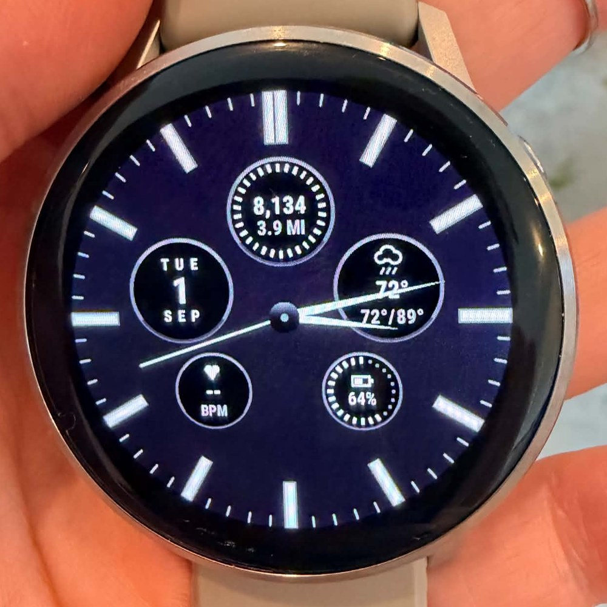
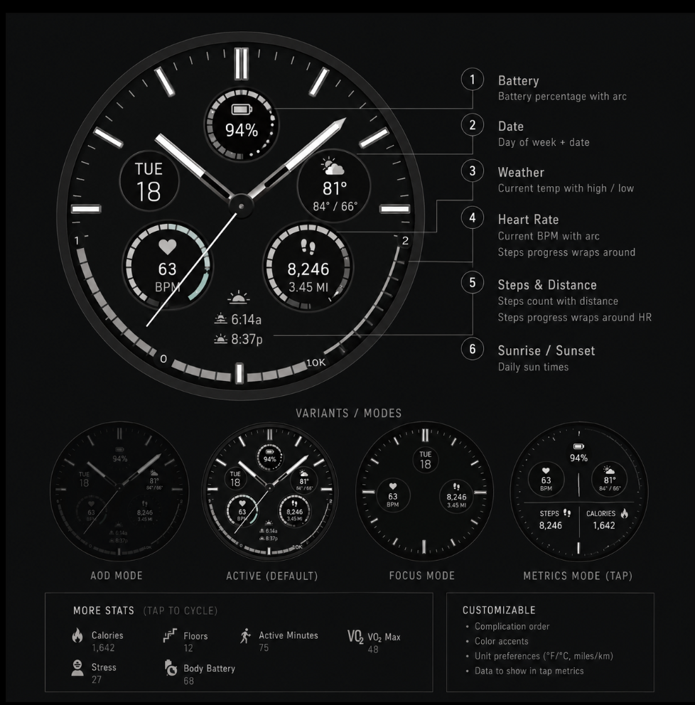

# FIELD

**A dense, monochrome analog dashboard watch face for the Garmin Venu 4.**

Every pixel is drawn imperatively in Monkey C. There is no layout XML, no UI
framework, and no bitmap assets besides the launcher icon: the dial, the
beveled hour indices, the sub-dial bezels, the weather icons and the heart
glyph are all generated from polar math and filled polygons at runtime.



<sub>Running on hardware. Heart rate reads `--` here because the watch is off-wrist; the 6 o'clock complication slot is currently empty.</sub>

<details>
<summary>The original design target</summary>



</details>

---

## Why this project exists

Connect IQ is a deliberately small sandbox. A watch face gets one `onUpdate`
call per minute in normal use, a fixed 454x454 round canvas, a subset of the
graphics API, and no access to most of the sensors an app can reach. That
makes it an unusually good exercise in constraint-driven UI engineering: the
interesting work is not adding features, it is fitting eight live data
readouts into a legible instrument face that degrades gracefully when any one
of them is unavailable.

## The face

| Position | Complication | Source |
|---|---|---|
| 12 o'clock | Step count, distance in miles, segmented goal ring | `ActivityMonitor` |
| 2-3 o'clock | Condition icon, current temp, day high/low | `Toybox.Weather` |
| 4-5 o'clock | Device battery, segmented level ring | `System.getSystemStats` |
| 7-8 o'clock | Live heart rate with a pulsing glyph | `Activity` / HR history |
| 9-10 o'clock | Day of week, month, date | `Time.Gregorian` |
| 6 o'clock | Printed complication slot (currently open) | swappable |
| Center | Hour, minute and sweep-seconds hands over a cannon pinion | `Time` |

## Architecture

`FieldView.onUpdate` is a composition root and nothing else: it clears the
frame and calls each component's `draw(dc, cx, cy)` in paint order. Every
visual element is an isolated class under `source/components/` that owns its
own geometry constants, its own data fetch, and its own failure mode. Adding,
removing or relocating a complication touches one file plus three lines of the
view.

Four shared modules keep the face coherent:

- **`Palette`** fixes a four-step monochrome hierarchy (primary values,
  secondary support, tertiary labels, plus a single accent reserved for
  alert and goal-met states, used nowhere else).
- **`Geometry`** exposes one polar helper in clock-fraction coordinates
  (`0.0` = 12 o'clock, increasing clockwise), so every radial position on the
  face is expressed the same way. Negative radii return the opposite side of
  center, which is how hand counterweights are placed.
- **`SubDial`** draws the shared top-lit beveled bezel, so the four circular
  sub-dials read as one family instead of four separate widgets.
- **`Fonts`** resolves a scalable vector font at a requested pixel height and
  falls back to a bitmap face when the device does not provide one.

## Constraints worth reading about

These are the problems that actually shaped the code.

**Unicode glyphs render as replacement boxes.** There is no reliable icon font
in this environment, so every symbol is a polygon. The cloud icons are drawn
by filling the silhouette and then carving an eroded black copy out of it
against the black dial face, which yields a clean outline stroke without an
outline API. The heart is assembled from convex primitives rather than one
concave polygon, because the device triangulates concave fills inconsistently
and the shape shimmered as it pulsed.

**Never size an element from the width of live data.** The date complication
scaled and letter-spaced its `TUE` / `SEP` labels to span a column derived from
the measured width of the day number, so on the 1st through the 9th a
single-character string collapsed the whole label stack to unreadable. The fix
is to measure a constant worst-case reference string instead and center the
variable data inside that fixed column. Every text group on the face now
measures and centers itself the same way.

**Runtime feature guards are not enough.** Connect IQ resolves permissions at
compile time, so an API reached only behind a `Toybox has :` runtime check
still hard-fails the build unless it is declared in the manifest. FIELD now
runs with an empty `<iq:permissions/>` block: it requests nothing from the
wearer, which was worth pruning the component set to achieve.

**Some APIs simply are not available to a watch face.** A sunrise/sunset
complication was built, shipped to the device, and retired after it proved
that position data is not reliably obtainable from the watch-face context, so
it displayed placeholder text indefinitely. It lives in `_retired/` alongside
the notes on why, rather than being deleted, because the constraint is more
useful than the code.

**Everything degrades to a dash.** Heart-rate reads are wrapped in a try/catch
and fall back from the live activity sample to the last valid history sample
before giving up. Weather, step goals and battery are null-guarded at every
level. A missing data source renders `--` in the correct typographic slot and
the rest of the face is unaffected.

## Build and run

Requires the Connect IQ SDK and the Garmin Monkey C extension for VS Code.

```
# simulator
Run > Start Without Debugging   (target: venu445mm_sim)

# device
Build for Device, then copy the .prg to GARMIN/APPS on the mounted watch
```

Target is the 45 mm Venu 4 (`venu445mm`), minimum API level 5.0.0.
`monkey.jungle` scopes `sourcePath` to `source/`, so `_retired/` is kept in the
repository without being compiled.

## Layout

```
source/
  FieldApp.mc          application entry point
  FieldView.mc         composition root and low-power state
  Palette.mc           color system
  Geometry.mc          polar helpers
  Fonts.mc             vector font resolution and fallback
  SubDial.mc           shared beveled bezel
  components/          one class per visual element
_retired/              complications removed on purpose, kept for the notes
docs/                  device photography
```

## Status

Running on hardware. Current work is on-wrist typography and collision tuning,
hand geometry, and an always-on display variant with burn-in mitigation.
